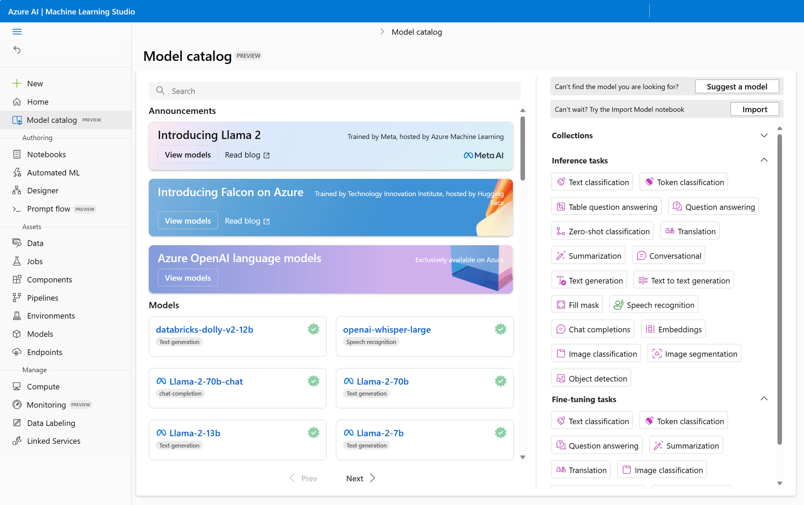

---
lab:
    title: 'Explore foundation models in the model catalog of Azure Machine Learning'
---

# Explore foundation models in the model catalog of Azure Machine Learning

Large Language Models (LLMs) used for Natural Language Processing (NLP) can be costly to train. To save time and effort, you can use open source models that are pre-trained on a large corpus of text. Many open source LLMs are available as foundation models in the model catalog of Azure Machine Learning.

In this exercise you'll explore the available foundation models in Azure Machine Learning's model catalog. You'll review model cards and their test results to evaluate which model best fits your needs.

## Before you start

You'll need an [Azure subscription](https://azure.microsoft.com/free?azure-portal=true) in which you have administrative-level access.

## Provision an Azure Machine Learning workspace

An Azure Machine Learning *workspace* provides a central place for managing all resources and assets you need to train and manage your models.

You'll provision the workspace through the Azure Portal, from which you can then launch the Azure Machine Learning studio. You'll use the studio to explore the foundation models in the model catalog.

1. Sign into the `https://portal.azure.com/`.
2. Create a new **Azure Machine Learning** resource with the following settings:
    - **Subscription**: *Your Azure subscription*
    - **Resource group**: `rg-genai-lab`
    - **Workspace name**: `mlw-genai-lab`
    - **Region**: *Select the geographical region closest to you*
    - **Storage account**: *Note the default new storage account that will be created for your workspace*
    - **Key vault**: *Note the default new key vault that will be created for your workspace*
    - **Application insights**: *Note the default new application insights resource that will be created for your workspace*
    - **Container registry**: None (*one will be created automatically the first time you deploy a model to a container*)
3. Wait for the workspace and its associated resources to be created - this typically takes around 5 minutes.

## Explore the model catalog

*Azure Machine Learning studio* is a web-based portal through which you can access the Azure Machine Learning workspace. You can use the Azure Machine Learning studio to manage all assets and resources within your workspace. To explore the foundation models, you can navigate to the model catalog in the studio.

1. In the Azure portal, navigate to the Azure Machine Learning workspace that starts with **rg-genai-lab**.
1. Select the Azure Machine Learning workspace, and in its **Overview** page, select **Launch studio**. Another tab will open in your browser to open the Azure Machine Learning studio.
1. Navigate to the **Model catalog**, using the menu on the left.



To explore foundation models in the model catalog, you can use the search bar at the top or scroll through the available models under **Models**.

If you don't know which model best fits your needs yet, you can use the filter pane on the right to explore models of a certain category.

There are two main filters you're likely to use when searching for a foundation model:

- **Inference tasks**: Filters models on tasks they can do when directly deploying the foundation model. Inference refers to the use of a deployed model.
- **Finetune tasks**: Filters models on tasks they can do when fine-tuning foundation models with your own data.

> **Note**:
> Some models have different inference and finetune tasks. For example, `bert-base-cased` can be used as is for fill mask tasks, and can be fine-tuned for text classification.

Let's explore foundation models based on their inference tasks.

## Explore question answering models

Let's explore question answering models first.

1. Select **Question answering** from the **Inference tasks** options in the filter pane.
1. Select **Curated by AzureML** from the **Collections** options in the filter pane.

    Note that all search results include `squad` in the title, referring to the **Stanford Question Answering Dataset**, which consists of a large collection of text passages, along with associated questions and answers. The models shown are the models that are trained on this dataset and therefore ideal for question answering tasks.

1. Select the `distilbert-base-uncased-distilled-squad` model.
1. Review the description. Optionally, you can select the link to the **original model card** to review more details in the Hugging Face Hub.
1. To quickly test the model, past the following text into the **Query** field of the **Sample inference** pane:

    ```
    How does the Amazon Rainforest contribute to regulating the Earth's climate?
    ```

1. Enter the following text in the **Context** field:

    ```
    The Amazon Rainforest, also known as the "Lungs of the Earth," is a vast tropical rainforest located in South America. It spans across several countries, including Brazil, Peru, and Colombia. The Amazon Rainforest is known for its incredible biodiversity, with millions of plant and animal species calling it home. It also plays a crucial role in regulating the Earth's climate by absorbing and storing carbon dioxide.
    ```

1. Select **Test** and review the result.

## Explore fill mask models

Now, let's explore models trained with a masked language modelling (MLM) objective.

1. Navigate to the **Model catalog**.
1. Select **Fill mask** from the **Inference tasks** options in the filter pane.
1. Select **Curated by AzureML** from the **Collections** options in the filter pane.

    Note that all search results include `bert` (or `roberta`) in the title, referring to the type of model. BERT models use bidirectional encoders, meaning that they use context presented before and after a token. They're trained with a MLM objective, making them ideal for predicting a masked word.

1. Select the `bert-base-uncased` model.
1. Review the description. Optionally, you can select the link to the **original model card** to review more details in the Hugging Face Hub.
1. Select the **Test** button in the **Sample inference** pane to test the model with the example query `Paris is the [MASK] of France`.
1. Change the query to:

    ````
    [MASK] is a popular sport in Brazil.
    ```

1. Select the **Test** button again and review the result.

With both examples, the model has no problem predicting what the masked word should be. Whether the necessary context is presented before or after the mask, the result is the same.

## Explore translation models

Finally, let's explore some models that you can use for translating text.

1. Navigate to the **Model catalog**.
1. Select **Translation** from the **Inference tasks** options in the filter pane.
1. Select **Curated by AzureML** from the **Collections** options in the filter pane.

    Note that all search results include `t5` in the title, referring to the type of model. T5 models use the Transformer architecture and have an encoder and decoder, allowing them to transfer text-to-text, which is ideal for translation tasks.

1. Select the `t5-small` model.
1. Review the description. Optionally, you can select the link to the **original model card** to review more details in the Hugging Face Hub.
1. Select the **Test** button in the **Sample inference** pane to quickly test the model.
1. Review the result and notice that the text is translated to German.

### Deploy the model to a real-time endpoint
    
The model can translate text to other languages too. You can specify the input and output language using parameters. Let's deploy the model to a real-time endpoint to explore the use of parameters.

1. Select **Deploy**.
1. Select **Real-time endpoint**.

> **Important**:
> You'll only use the endpoint for some quick testing. To minimize costs, you should delete the endpoint when you're done exploring the model.

1. Select the smallest **Virtual machine** available to you.
1. Change the **Instance count** to `1`.
1. You'll create a **New** endpoint. Leave all other settings at their default values.
1. Select the **Deploy** button to create the endpoint and deploy the model to the endpoint. The process may take around 15 minutes.

> **Note**:
> In this exercise you're using the `t5-small` model which has considerably less parameters than the `t5-large` model. The `t5-small` model may have more inaccurate results, but since it's smaller in size, it'll be cheaper to use.

Azure Machine Learning will first create the endpoint. You can deploy multiple models to one endpoint. After the endpoint is created, the foundation model you selected will be deployed to the endpoint. Since you only have one model deployed to the endpoint, Azure Machine Learning will allocate all (100%) of incoming traffic to the model you selected. If you deploy multiple models to the endpoint, you can specify how much traffic should be allocated to each model.

### Test the deployed translation model

When the **Provisioning state** of the deployment is **Succeeded**, the endpoint is ready to use.

1. Navigate to the **Test** tab of the endpoint.
1. Paste the following JSON in the **Input data to test endpoint** field:

    ```json
    {
    "inputs": {
        "input_string": ["My name is John and I live in Seattle", "Berlin is the capital of Germany."]
    },
    "parameters": {
        "task_type": "translation_en_to_fr"
    }
    }
    ```

1. Review the result and notice that the text is now translated to French. Optionally, you can change the input string and the translation parameter to test other examples.

## Delete Azure resources

When you finish exploring Azure Machine Learning, you should delete the resources you’ve created to avoid unnecessary Azure costs.

- Close the Azure Machine Learning studio tab and return to the Azure portal.
- In the Azure portal, on the **Home** page, select **Resource groups**.
- Select the resource group starting with **rg-genai...**.
- At the top of the **Overview** page for your resource group, select **Delete resource group**.
- Enter the resource group name to confirm you want to delete it, and select **Delete**.
